# Anbeeld's Custom AI Repository Documentation

## Scope and method

This document is based on direct inspection of every file in this repository.

Evidence sources used:

- Repository files under `common/`, `events/`, and `localisation/`
- Runtime tracing from `common/on_actions/*` into event chains, scripted effects, and scripted triggers
- The installed game snapshot at `D:\SteamLibrary\steamapps\common\Stellaris`, used only to confirm folder/category alignment and object-key override strategy

Verification limits:

- The repository itself does not expose an internal version manifest.
- The installed game snapshot's exact Stellaris version could not be confirmed from accessible metadata.
- Because the user stated this mod targets Stellaris 2.1.3, all behavioral claims in this document are grounded in the repository itself. Any vanilla comparisons here are structural and illustrative, not a guaranteed exact 2.1.3 line-by-line diff.

## What this repository is

This is a pure Clausewitz-script AI mod. It contains no compiled code and no external runtime. Everything is implemented through Stellaris data and event scripting:

- `on_actions` define entry points
- `country_event`, `planet_event`, and `fleet_event` scripts drive active behavior
- `scripted_effects` and `scripted_triggers` act as the internal logic library
- `common/*` data files override vanilla AI weights, AI-eligibility rules, and some global defines

Operationally, the mod is a three-layer system:

1. A proactive Anbeeld controller (`aai_*` and `acai_*`) that schedules economy, fleets, buildings, starbases, armies, robots, and repair behavior.
2. A legacy `gai_*` repair/compatibility layer that still handles colonization, critical buildings, edict simulation, war nudging, Rogue Servitors, and a few one-off fixes.
3. A broad data-override layer that rewrites how vanilla AI chooses perks, traditions, techs, components, ship sections, buildings, starbase buildings, megastructures, sector types, opinion values, and global AI defines.

## Repository structure

| Path | Role |
| --- | --- |
| `common/` | Data overrides, helper libraries, defines, triggers, effects, and on-actions |
| `events/` | Active runtime behavior |
| `localisation/` | A small English localisation file containing NSC warning text plus legacy GAI toggle strings |
| `thumbnail.png` | Mod preview image |

## Runtime entry points

The mod's runtime starts in `common/on_actions`.

### Core scheduler

`common/on_actions/ACAI_On_Actions.txt` is the main Anbeeld entry file:

- `on_monthly_pulse` fires `aai_monthly.1`
- `on_yearly_pulse` fires `aai_yearly.1`
- `on_game_start` fires both `aai_monthly.1` and `aai_yearly.1`
- `on_game_start_country` fires `aai_yearly.2` and `aai_yearly.10`
- A separate `on_entering_war` hook is present but commented out

### Legacy fix hooks

`common/on_actions/gaifixmod_events.txt` activates the still-used legacy layer:

- `on_yearly_pulse` fires:
  - `gai_edict.1`
  - `no_starbase_defense.1`
  - `gai_bio_trophy.1`
  - `gai_ai_colonize.1`
  - `gai_critical_buildings.1`
  - `gai_clear.1`
  - `gai_war.1`
- `on_entering_war` fires `gai_clear.1`
- `on_game_start` fires `ai_fixmod_flag.1`
- `on_colonized` fires `gai_ai_colonize.3`

### Runtime flow

```mermaid
flowchart TD
    GS["on_game_start"] --> M["aai_monthly.1"]
    GS --> Y["aai_yearly.1"]
    GS --> F["ai_fixmod_flag.1"]
    GSC["on_game_start_country"] --> Y2["aai_yearly.2"]
    GSC --> Y10["aai_yearly.10"]
    MP["on_monthly_pulse"] --> M
    YP["on_yearly_pulse"] --> Y
    YP --> GE["gai_edict.1"]
    YP --> GCOL["gai_ai_colonize.1"]
    YP --> GCB["gai_critical_buildings.1"]
    YP --> GW["gai_war.1"]
    YP --> GBT["gai_bio_trophy.1"]
    YP --> GNS["no_starbase_defense.1"]
    YP --> GCL["gai_clear.1"]
    WAR["on_entering_war"] --> GCL
    COL["on_colonized"] --> COL3["gai_ai_colonize.3"]
```

## State model and internal conventions

The mod is stateful. It persists decisions in country, planet, star, fleet, and global variables/flags.

The repository does not explicitly document the naming convention, but in practice:

- `aai_*` and `acai_*` are mod-owned variables, flags, triggers, and effects
- `gai_*` marks the legacy Glavius-style compatibility/fix layer

Key state objects:

| State | Stored on | Purpose |
| --- | --- | --- |
| `acai_days_scope` | Global event target | Holds rolling day counters used to distribute monthly work across different dates |
| `acai_value_day_monthly_*` | `acai_days_scope` target | Economy, ship, robot, and building schedule windows |
| `acai_corvette_preference`, `acai_battleship_preference` | Country flags | Long-lived doctrine flags that influence research, ship sections, components, and actual ship production |
| `acai_destroyer_preference` | Country flag | Checked actively in tech and component AI weights, but the assignment code in `aai_yearly.10` is commented out and any existing flag is explicitly removed; effectively a dormant doctrine that still shapes data-layer weights if manually set |
| `acai_value_energy_*`, `acai_value_minerals_*`, food booleans | Country variables | Coarse economy model used by builders, colonization, ship logic, and robot logic |
| `acai_boolean_deposit_planet`, `acai_value_minerals_deposit` | Country variables | Virtual mineral reserve for colony ships |
| `acai_value_main_fleet_*` | Fleet and country variables | Strongest-fleet detection and tie-breaking |
| `acai_value_naval_capacity_*` | Country variables | Quantized naval capacity model, expected queued cap, and delete/free thresholds |
| `acai_ships_busy_shipyards_1..6` | Star/planet flags | Tracks occupied shipyard slots so the script does not over-queue one starbase |
| `acai_starbases_shipyard`, `acai_starbases_trading_hub`, `acai_starbases_anchorage` | Star flags | Marks the role assigned to each upgraded starbase |
| `aai_rebuild_food`, `aai_rebuild_energy` | Planet flags | Cooldowns for emergency building replacement passes |
| Healing variables and flags | Fleet/system scope | Track repair lock state, destination, and retry behavior |
| `transport_five_year_clear`, `gai_clear_fired` | Country flags | Legacy wartime order-cleanup state |

Likely rationale, inferred from the long variable ladders: the author avoids fragile direct arithmetic and instead quantizes resources and ratios into stable breakpoints that Clausewitz script can compare reliably.

## Core behavioral systems

## 1. Monthly orchestration

Main file: `events/Anbeelds_AI_Monthly.txt`

### What it does

`aai_monthly.1` is the central monthly dispatcher for active AI empires.

It performs four jobs:

- Maintains rolling day counters in the global `acai_days_scope`
- Applies monthly strongest-fleet healing checks
- Starts stuck-transport recovery checks
- Spreads economy, ship, robot, and building logic over several days instead of running everything on one pulse

### Why it exists

Without scheduling, every AI empire would run every heavy decision routine on the same monthly pulse. This file deliberately staggers work, which lowers burst load and reduces synchronized AI behavior.

### Implementation specifics

- The event picks or reuses a random planet as `acai_days_scope`.
- Economy work cycles through days 1 to 7.
- Ship work cycles through days 8 to 15.
- Robot work cycles through days 16 to 19.
- Building work is split into separate normal-planet, upgrade/replacement, and habitat waves.
- While iterating AI empires, it also:
  - checks whether the strongest fleet is damaged and at war
  - looks for a usable owned starbase for repair
  - triggers the transport stuck-fix subsystem if required

### Expected outcome

The mod behaves like a persistent planner rather than a once-a-month panic script. Empires are recalculated often, but not all at once.

## 2. Yearly orchestration

Main file: `events/Anbeelds_AI_Yearly.txt`

### What it does

`aai_yearly.1` is the long-cycle scheduler. It runs less frequently but launches the heavier empire-wide recalculations and strategic maintenance.

It schedules:

- pop and food recalculation
- civilian ship production checks
- army production
- idle transport recall
- starbase specialization and upgrades
- naval capacity recalculation
- AI ship-preference assignment and upgrade-cost bandaid

### Why it exists

These systems do not need monthly cadence. Running them yearly is enough to keep empires aligned without wasting script time.

### Implementation specifics

- `aai_yearly.2` calls `aai_calc_pops_and_food`
- `aai_yearly.3` calls `aai_civilian.1`
- `aai_yearly.4` calls `aai_armies.1`
- `aai_armies.10` recalls idle transport fleets
- `aai_yearly.5` calls the starbase planner
- `aai_yearly.6` recalculates naval capacity and desired usage bands
- `aai_yearly.10` assigns either corvette or battleship preference when an empire has none, removes any existing `acai_destroyer_preference`, and applies the free-upgrade bandaid

### Expected outcome

The AI periodically recenters its long-term plan: what to research toward, how much navy to aim for, how many civilian ships to keep, and how to structure starbases.

## 3. Economy evaluation

Main files:

- `common/scripted_effects/Anbeelds_AI_Economy.txt`
- `common/scripted_effects/Anbeelds_AI_Pops_and_food.txt`
- `common/scripted_triggers/ACAI_Economy_triggers.txt`

### What it does

The mod maintains a coarse internal economy model rather than relying directly on raw monthly income values everywhere.

It computes:

- energy stockpile and produced energy
- effective energy income
- minerals income
- pop count
- food pressure
- mineral-income thresholds derived from pop count
- a virtual mineral reserve for colony ships

### Why it exists

Most other subsystems need stable yes/no decisions such as "energy low", "food medium", or "minerals extreme". Centralizing those thresholds avoids each event reinventing inconsistent rules.

### Implementation specifics

`aai_calc_economy`:

- quantizes energy stockpiles and energy/mineral incomes into discrete variables (e.g. `acai_value_minerals_income` in 5-unit steps from 5 to 100+)
- computes an energy stock segment (`aai_value_energy_stock_segment`) by multiplying energy production by 6 and dividing by income thresholds
- subtracts estimated main-fleet upkeep from energy income when the strongest fleet is parked at a friendly crew-quarters starbase; the upkeep deduction scales by game age in 15-year brackets (0.175 energy early to 0.25+ late)
- derives mineral income margin thresholds (`acai_value_minerals_income_extreme_margin`, `acai_value_minerals_income_low_margin`) with 10% percentage buffers above the base breakpoints
- sets boolean-style thresholds such as:
  - `aai_boolean_energy_income_low`
  - `aai_boolean_energy_income_medium`
  - `aai_boolean_energy_income_high`
  - `acai_boolean_minerals_income_extreme` / `acai_boolean_minerals_income_extreme_margin`
  - `acai_boolean_minerals_income_low` / `acai_boolean_minerals_income_low_margin`

`aai_calc_pops_and_food`:

- skips food calculations entirely for machine intelligences
- counts usable pops into `aai_value_num_pops`
- sets food income thresholds across 26 discrete levels (not just low/medium/high); scaling differs by empire size (empires under 200 pops divide by 20, larger ones divide by 40 with +5 compensation, then add base 2)
- derives mineral-pressure reference values from pop count using specific formulas: `acai_value_minerals_income_low = (pops / 2) + 10`, `acai_value_minerals_income_extreme = (pops / 4) + 5`

`acai_calc_deposit`:

- when `acai_boolean_deposit_planet == 2`, moves minerals into `acai_value_minerals_deposit` in steps of 5
- caps the reserve at 300
- this reserve is spent by colonization instead of the normal stockpile

### Expected outcome

- AI building and ship decisions respond to broad economic state, not one-off noise
- Early empires can deliberately save for colony ships
- Main-fleet upkeep affects AI expansion and production decisions in a way the vanilla AI often mishandles

## 4. Colonization and colony setup

Main file: `events/gai_ai_colonize.txt`

### What it does

The legacy colonization layer still actively controls when AI empires colonize and how newly colonized worlds are initialized.

### Why it exists

The repository uses a custom mineral reserve and tile-aware colony-shelter placement that vanilla AI does not provide.

### Implementation specifics

`gai_ai_colonize.1`:

- scans AI empires with valid colonizable planets
- rejects empires with low energy income
- requires either:
  - at least 300 minerals
  - or a full 300-mineral colony reserve in `acai_value_minerals_deposit`
- if below 300 minerals and under 3 planets, enables deposit saving by setting `acai_boolean_deposit_planet = 2`

`gai_ai_colonize.2`:

- finds a legal colonizing species from owned pops with habitability > 0.19, excluding pops with assimilation or purge citizenship
- avoids holy worlds if any holy-world guardian exists
- starts the colony
- spends either the reserved deposit or the regular stockpile (300 minerals)
- always also spends 100 energy

`gai_ai_colonize.3`:

- runs on `on_colonized`
- for AI owners, removes the initial shelter/deployment-post placement and relocates it to a better tile
- uses 27 cascading priority conditions for non-machine empires and 23 for machine intelligences, prioritizing 4-adjacency energy tiles (no research neighbors) → 4-adjacency blank → 4-adjacency food → then progressively relaxing adjacency and tile-type requirements
- machine intelligences place `building_deployment_post` instead of `building_colony_shelter` with a different priority tree
- includes a Machine Assimilator branch that adds a colonist pop of a viable organic species

### Expected outcome

- AI empires colonize when they can actually support it
- Colony ships do not consume minerals that were implicitly needed elsewhere unless the AI has enough
- New colony capitals land on better tiles than the default script would place them on

## 5. Planet building logic

Main files:

- `common/scripted_effects/Anbeelds_AI_Buildings.txt`
- `events/Anbeelds_AI_Buildings.txt`
- `common/scripted_triggers/Anbeelds_AI_Conditions.txt`
- `common/scripted_triggers/Anbeelds_AI_Buildings.txt`
- `events/gai_critical_buildings.txt`
- `events/gai_servitors.txt`

### What it does

This is the main planetary economy builder. It covers:

- empty-tile construction on normal planets
- empty-tile construction on habitats
- emergency rebuilding when food, energy, or the capital is missing
- building upgrades
- critical empire-unique support buildings the AI often forgets
- Rogue Servitor bio-trophy placement and nutrient-paste handling

### Why it exists

Planet management is the core of the mod. Most of the repository exists either to feed or to support building decisions.

### Implementation specifics

#### Empty-tile construction on normal planets

`aai_planet_building_construction` chooses a target tile and then picks a building using tile yields and empire state.

Observed priority order:

- restore a missing capital
- use species/planet-specific specials such as alien pets or Betharian deposits
- fix low food
- fix low energy
- use research tiles for labs
- use mineral tiles for mines
- on blank tiles, choose between science and mining early, then balance later

Additional logic in the empty-tile construction pass:

- strategic resource buildings: Alien Pets (XZoo/Animal Lab with `tech_alien_life_studies`) and Betharian power plants (`tech_mine_betharian`)
- research lab realignment: detects mismatched labs (e.g. physics tile with biolab) and demolishes/rebuilds with the correct lab type
- machine intelligences are excluded from all food-related building logic

The logic is guarded by helper triggers such as:

- tile yield detectors for food, minerals, energy, research, strategic resources, and blank tiles
- "important building" lists
- planet suitability checks
- Rogue Servitor organic-pop restrictions (26+ instances of `acai_rogue_servitors_not_organic` checks)

#### Habitat construction

`aai_habitat_building_construction` is much simpler:

- capital first
- solar power if energy is low
- agriculture if food is low and the empire is not machine
- otherwise weighted choice between research and mining habitat modules

#### Monthly build passes

`aai_buildings.40`:

- removes `building_junkheap`
- fills an empty valid tile on a normal colony
- if there is no good empty tile, runs emergency replacement logic
- can demolish and replace buildings to restore capital, food, or energy

`aai_buildings.45`:

- handles capital upgrades and conventional building upgrades
- confirmed upgrade paths include:
  - colony shelter/deployment post to capital tier 1
  - capital tier 1 to tier 2
  - capital tier 2 to tier 3
  - mining networks up to tier 5
  - power plants up to tier 5
  - farms up to tier 5
  - mineral processing, power hubs, hospitals, assembly plants
  - unity chains for spiritualist, machine, and generic empires
  - research lab chains for all three science branches

`aai_buildings.50`:

- fills empty habitat tiles
- otherwise demolishes and replaces habitat buildings to restore missing capital, food, or energy

#### Critical building enforcement

`gai_critical_buildings.1` and `.2` are still active yearly.

They scan upgraded-capital colonies and ensure the planet has the appropriate support structure set:

- unity building
- growth building
- paradise dome
- power hub
- purifier building
- slave processing
- mineral processing
- hive synapse
- machine control center

This logic uses the large legacy trigger library in `common/scripted_triggers/gai_triggers.txt`.

#### Rogue Servitor support

`gai_bio_trophy.1` and `.2`:

- only apply to AI Rogue Servitors at peace
- find a valid organic bio-trophy species
- either grow/place a bio-trophy on an appropriate food tile
- or, if food is too low, construct `building_nutrient_paste_facility` instead

### Expected outcome

- AI worlds fill in a goal-directed order instead of random or purely yield-driven order
- emergency shortages can trigger demolition and replacement
- habitats do not use the normal-planet logic
- critical support buildings appear reliably instead of being forgotten forever
- Rogue Servitors maintain bio-trophies in a more stable way

## 6. Civilian ship production

Main file: `events/Anbeelds_AI_Civilian.txt`

### What it does

This subsystem creates constructors and science ships directly.

### Why it exists

The mod does not trust vanilla AI to keep the exploration and construction pipeline healthy.

### Implementation specifics

`aai_civilian.1`:

- checks current year
- compares current counts against year-based targets
- spawns ships at a random safe owned planet
- spends 100 minerals per constructor or science ship

Year-based targets:

- first 5 years: 1
- years 5 to 10: 2
- year 10 onward: 3

### Expected outcome

Exploration and basic infrastructure expansion keep moving even if the base AI would stall.

## 7. Robot assembly

Main file: `events/Anbeelds_AI_Robots.txt`

### What it does

This subsystem creates robot-pop construction orders on suitable colonies.

### Why it exists

Robot assembly is economically valuable but easy for AI to underuse or use inconsistently.

### Implementation specifics

`aai_robots.1`:

- chooses an owned colony with free tile space
- avoids planets already growing too many robot pops
- for machine intelligences and `synthetic_age`, directly builds the top-tier robot pop
- otherwise picks the highest unlocked tier:
  - synthetic
  - droid
  - robot
- spends 100 minerals

### Expected outcome

Machine empires and robot-capable empires keep assembling worker pops instead of leaving empty space idle.

### Known quirk

The machine-intelligence branch checks `aai_var_energy_income_medium`. That variable name does not appear to be produced anywhere else in the repository. The rest of the economy system uses `aai_boolean_energy_income_medium` or value-style variables. This is probably a typo or dead condition.

## 8. Fleet production, composition, and delivery

Main files:

- `events/Anbeelds_AI_Ships.txt`
- `common/scripted_effects/ACAI_Ships_Effects.txt`
- `common/scripted_effects/ACAI_Main_fleet_calculating.txt`
- `common/scripted_effects/ACAI_Naval_capacity_calculating.txt`
- `common/scripted_triggers/ACAI_Ships_triggers.txt`
- `common/scripted_triggers/ACAI_Main_fleet_triggers.txt`
- `common/component_templates/*`
- `common/section_templates/*`
- `common/technology/*`

### What it does

This is the mod's custom navy manager. It decides:

- when to build ships
- when to disband ships
- what hull size to build
- where to build it
- how to reserve shipyard capacity
- how to reserve expected naval cap
- how to deliver newly created ships to the main fleet

### Why it exists

The repository clearly treats navy behavior as one of vanilla Stellaris AI's main weaknesses. The mod therefore replaces both the strategic production choice and much of the tactical designer preference data.

### Implementation specifics

#### Main-fleet detection

`acai_main_fleet_calculating`:

- iterates military fleets
- stores a quantized `fleet_power`
- assigns a monotonically increasing identificator to break ties

`acai_main_fleet_current_strongest`:

- selects the strongest fleet using those values

This strongest-fleet concept is used by:

- upkeep estimation
- repair logic
- ship delivery
- ship disband gating

#### Naval-capacity model

`acai_naval_capacity_calculating`:

- quantizes both max and used naval capacity into coarse breakpoints
- computes a usage ratio
- subtracts already-processed queued capacity from the expected queue reserve

`acai_naval_capacity_usage_calculating`:

- starts from default desired utilization:
  - high war: 1.10
  - high peace: 1.00
  - low war: 0.70
  - low peace: 0.60
- shifts those values upward for:
  - fanatic militarists
  - militarists
  - genocidal civics
  - machine assimilators
- shifts them downward for:
  - Inward Perfection
  - pacifists
  - fanatic pacifists
- calculates separate delete thresholds and free-capacity values

This gives the ship logic a policy layer rather than a single fixed ratio.

#### Build vs disband decision

`aai_ships.1` uses:

- war state
- threat state and rivals
- energy pressure
- mineral pressure
- naval-capacity free/delete bands

It then calls either:

- `acai_ships_build`
- or `acai_ships_destroy`

#### Actual ship production

`acai_ships_build`:

- picks a random owned starbase with shipyard modules and free busy-slot capacity
- if the empire has battleships, prefers battleship production only for `acai_battleship_preference` empires with more than 2000 minerals
- otherwise builds corvettes
- marks the shipyard busy
- reserves expected naval capacity

Confirmed build behavior:

- Battleship:
  - queued by `aai_ships.13`
  - 480-day delay
  - 2000 minerals
  - reserves 8 expected naval cap
- Corvette:
  - queued by `aai_ships.10`
  - 60-day delay
  - year-scaled cost from 140 to 320 minerals
  - reserves 1 expected naval cap

Destroyer and cruiser build paths exist in comments but are not active.

#### Shipyard busy-slot tracking

`acai_ships_make_shipyard_busy` and `acai_ships_make_shipyard_free`:

- manage six shipyard-busy flags
- effectively emulate queue occupancy without reading the vanilla queue in a richer way

#### Disband behavior

`acai_ships_destroy`:

- only runs if the main fleet is not in combat, or if no main fleet exists
- destroys one random ship
- prefers to remove:
  - corvettes first
  - then destroyers only if no corvettes exist
  - then cruisers only if no smaller ships exist
  - then battleships only if no smaller ships exist

#### Delivery system

`aai_ships.2`, `.3`, `.20`, `.23`, `.40`, `.43`, `.60`, `.63`:

- do not just spawn the ship into the main fleet immediately
- instead, they create the ship at a shipyard or local starbase
- then route it through a delayed delivery chain toward the main fleet or a fallback destination
- if the route or destination fails, the script can refund the build

This is a workaround for the limited control Clausewitz event scripts have over reinforcements.

#### Fleet meta shaping through static data

The runtime ship builder is only half the story. The data overrides strongly bias what kinds of ships the vanilla designer will produce.

Confirmed patterns:

- `common/section_templates/corvette.txt` strongly prefers torpedo corvettes and zeroes out several alternative corvette middles
- `common/section_templates/battleship.txt` prefers long-range/artillery battleship sections and disables several weaker or situational layouts
- `common/component_templates/00_ACAI_Combat_computers.txt` strongly favors artillery computers for destroyer/battleship-pref empires
- `common/component_templates/00_ACAI_Afterburners.txt` heavily favors afterburners for corvette-pref and pre-battleship strategies
- `common/component_templates/00_ACAI_Auxiliary.txt` favors fire-control for battleship-pref empires once battleships are unlocked
- `common/technology/*.txt` uses `years_passed` and preference flags to bias research into or away from hull lines, ship upgrades, and weapons

### Expected outcome

- Corvette-pref empires stay small-hull focused much longer
- Battleship-pref empires jump hard into artillery battleships once the economy supports it
- Fleets are kept closer to target utilization instead of drifting randomly
- New ships arrive at the main fleet more reliably than simple spawn-at-capital behavior would allow

## 9. Fleet repair and healing

Main files:

- `events/ACAI_Healing_Events.txt`
- `common/scripted_effects/ACAI_Healing_Effects.txt`
- `common/scripted_triggers/ACAI_Healing_Triggers.txt`

### What it does

This subsystem takes the strongest damaged fleet at war and explicitly moves it to a repairable friendly starbase, then locks it there while it regenerates.

### Why it exists

Vanilla AI fleets frequently remain active while badly damaged or fail to choose good repair opportunities.

### Implementation specifics

`acai_healing.1`:

- only considers the current strongest fleet
- requires war state and some damage
- searches for an owned starbase at least `starbase_starport`
- will wait if the fleet is in combat or lacks a valid system
- uses damage thresholds that get stricter with repair distance:
  - repair almost always when very damaged
  - tolerate less damage only when the repair target is close
- if already at a suitable starbase and no hostiles are present:
  - clears orders
  - applies `acai_healing_locking_by_speed`
  - applies `acai_healing_emulate_repairing`
- if not yet at the right system:
  - chooses a destination by increasing jump radius
  - fires `acai_healing.2` to issue movement

`acai_healing.2`:

- orders travel toward the chosen repair system
- rechecks after 30 days

Static modifiers used:

- `acai_healing_locking_by_speed`: effectively freezes the fleet
- `acai_healing_emulate_repairing`: grants high hull and armor regen

### Expected outcome

The main wartime fleet survives longer and stops throwing half-destroyed ships back into combat.

## 10. Armies and transport reliability

Main files:

- `events/Anbeelds_AI_Armies.txt`
- `common/scripted_effects/ACAI_Armies_Effects.txt`

### What it does

This subsystem handles:

- assault army production
- idle transport recall in peacetime
- recovery for transport fleets that become stuck or invalid

### Why it exists

Transport fleets are one of the most failure-prone vanilla AI units. The mod explicitly patches around that.

### Implementation specifics

`aai_armies.1`:

- builds assault armies on the capital or a safe alternative planet
- repeats until it reaches a comfortable count or minerals stop allowing it
- spends 100 minerals per army

`aai_armies.10`:

- in peace, recalls transport-only fleets that are sitting away from useful friendly territory

`aai_armies.2`:

- is the stuck-fix event
- checks transport fleets that have land-army orders but no valid solar system
- retries for a while
- eventually can delete the broken transport fleet and recreate the army load as a fresh transport fleet

Helper effects:

- `acai_armies_stuckfix_call`
- `acai_armies_stuckfix_cancel`

### Expected outcome

AI invasions still are not sophisticated, but the transport layer is far less likely to collapse permanently.

## 11. Starbase planning

Main files:

- `common/scripted_effects/Anbeelds_AI_Starbases.txt`
- `common/scripted_effects/ACAI_Starbases_Effects.txt`
- `common/scripted_triggers/Anbeelds_AI_Starbases.txt`
- `common/scripted_triggers/ACAI_Starbases_triggers.txt`
- `events/Anbeelds_AI_Starbases.txt`

### What it does

The starbase system classifies upgraded starbases into roles and then builds modules/buildings according to those roles.

Roles:

- shipyard
- trading hub
- anchorage

Note: `aai_starbases.500` defines a defensive conversion layout pass, but it is `is_triggered_only` and no event or effect ever fires it. It is dormant dead code.

### Why it exists

This is a direct replacement for vanilla starbase indecision. The repository wants role-specialized starbases, not mixed random ones.

### Implementation specifics

`aai_calc_starbases`:

- counts upgraded starbases
- counts existing shipyards and trading hubs
- computes desired starbase cap from pops, systems, tech, traditions, and `ap_grasp_the_void`
- caps desired total by owned systems
- computes role targets with fixed formulas:
  - shipyards start at 1 and gain +1 per 10 points of desired starbase limit once the limit reaches 11
  - trading hubs start at 2 and gain +1 per 4 points of desired starbase limit once the limit reaches 7
  - anchorages absorb the remainder or any excess role assignments
- stores role flags on the system star, not on the starbase object itself

`aai_starbases.1`:

- assigns roles to existing upgraded starbases in priority order
- prefers reusing already-partial shipyards or trading hubs before repurposing generic starbases
- treats systems with an owned colony, an ongoing colonization, or a trader enclave as fully suitable for trading hubs
- treats systems with only colonizable planets as potential future trading-hub systems
- converts oversupplied shipyards/trading hubs and unused upgraded bases into anchorages

`aai_starbases.2`, `.3`, `.4`:

- run one construction pass for shipyards, anchorages, and trading hubs respectively

`aai_starbases.5`:

- recalculates counts
- prioritizes outposts for upgrading
- uses `acai_boolean_trading_hub_priority` to decide whether outpost upgrades should favor immediately suitable trade systems, future trade systems, or any valid outpost
- prefers safer candidates first by checking for hostile neighbors at two jumps, then one jump, then direct adjacency
- upgrades outposts and larger starbases through the size chain
- uses different mineral thresholds
- contains `ap_voidborn` handling as a reserve requirement, not a higher actual upgrade cost

`aai_starbases.500` (dormant — defined but never triggered):

- would convert non-shipyard upgraded starbases in systems without colonies or colonizable worlds into a defensive layout
- defined patterns:
  - starport: gun battery, missile battery, target uplink
  - starhold: adds hangar bay, gun battery, and communications jammer
  - fortress: adds two more gun batteries and disruption field

`ACAI_Starbases_Effects.txt` contains the concrete module/building writers:

- `acai_starbases_set_shipyard`
- `acai_starbases_set_trading_hub`
- `acai_starbases_set_anchorage`
- `acai_starbase_shipyard_construction`
- `acai_starbase_anchorage_construction`
- `acai_starbase_trading_hub_construction`

These effects:

- fill all module slots for the chosen role when possible
- add role-appropriate buildings such as crew quarters, fleet academy, logistics office, offworld trading company, titan yards, colossus yards, black site, hydroponics bay, warp fluctuator, or communications jammer
- spend minerals directly from the owning empire

### Expected outcome

- More role-pure shipyard and anchorage networks
- More trading hubs in colony systems, trader-enclave systems, and candidate future-colony systems
- Fewer random starbase layouts
- Better late-game access to titan and colossus infrastructure
- Note: the defensive conversion pass (`aai_starbases.500`) is defined but never triggered, so non-colony starbases are not automatically converted to defensive layouts despite the code existing

## 12. Edict simulation and economic buffs

Main files:

- `events/gai_edicts.txt`
- `common/static_modifiers/gai_static_modifiers.txt`
- `common/edicts/00_campaigns.txt`
- `common/edicts/01_edicts.txt`

### What it does

The mod splits edicts into two separate systems:

- campaign edicts remain real edicts but are retuned
- core empire edicts are effectively driven by scripted modifiers instead of AI self-casting the edict definitions directly

### Why it exists

The author clearly wanted tighter control over when AI empires consume influence or energy for empire-wide buffs.

### Implementation specifics

`common/edicts/00_campaigns.txt`:

- turns campaign edicts into energy-cost, 3600-day campaigns
- gives them explicit AI weights tied to energy stockpile and income

`common/edicts/01_edicts.txt`:

- leaves the regular influence edicts defined
- but sets their `ai_weight` to zero

`gai_edict.1` dispatches to `gai_edict.2` for every AI default-type country.

`gai_edict.2` then simulates the important ones by applying modifiers directly when conditions are met:

- `ai_capacity_overload_edict` — requires `tech_power_hub_1`, costs 300 influence
- `ai_production_targets_edict` — requires `tech_colonial_centralization`, costs 300 influence
- `ai_research_focus_edict` — requires materialist ethic, costs 300 influence
- `ai_healthcare_campaign` — requires `tech_planetary_unification`, 3000+ energy, >25 energy/month; blocked for machine intelligences
- `ai_robot_campaign` — same thresholds but only for machine intelligences
- `ai_recycling_campaign` — requires machine intelligence, 4000+ energy, >25 energy/month
- enclave-like modifiers:
  - mineral trade tiers 1/2/3 at 2400/6000/12000 energy, requiring trader enclave relations
  - curator insight at 5000 energy, requiring curator enclave relations
  - artist patron equivalent at 5000 energy, requiring artist enclave relations

`gai_edict.3` manages the `ai_fix_subject_1` modifier: applies it to AI subjects and removes it when they lose subject status.

The same event also contains a disabled branch with `always = no`, meaning part of the older edict logic is intentionally dead.

### Expected outcome

The AI gets the intended global bonuses, but under script control instead of the base AI's edict heuristics.

## 13. War pressure and wartime cleanup

Main files:

- `events/gai_war.txt`
- `events/gai_clear.txt`
- `events/gai_no_starbase_defense.txt`
- `common/opinion_modifiers/Anbeelds_AI_Relations.txt`
- `common/defines/ACAI_Defines.txt`

### What it does

This part of the repository pushes AI empires toward more decisive war behavior and tries to prevent several war-related stall states.

### Why it exists

The repository is not only an economy mod. It also tries to stop passive midgame stagnation.

### Implementation specifics

`gai_war.1` and follow-up events:

- scan peaceful AI empires with enough strength and economy
- reject pacifists, federated empires, subjects, and weak empires
- look for weaker neighboring AI empires
- choose war goals based on civics and target type:
  - conquest
  - cleansing
  - absorption
  - assimilation
  - end-threat war goals
  - awakened-empire domination

`gai_clear.1` through `.4`:

- `.1` dispatches to `.2`, `.3`, or `.4` based on war state and flag presence
- `.2` on first war entry: forces all transport and military fleets to return, sets `gai_clear_fired` flag and `transport_five_year_clear` timed flag (720 days)
- `.3` removes the `gai_clear_fired` flag when the empire is no longer at war
- `.4` re-fires transport-only cleanup every 180 days while war continues (shorter cooldown than initial `.2`)

`no_starbase_defense.1`:

- for poor AI empires with monthly energy income < 45 and monthly minerals income < 150
- applies `no_platforms` for 480 days
- `no_platforms` reduces starbase defense platform capacity by 50

The define and opinion files also support aggression indirectly by changing:

- war targeting priorities
- claim valuation
- threat values
- friction and trust behavior
- war exhaustion handling

### Expected outcome

- More wars after long peace
- Fewer bankrupt AIs wasting money on defense platforms
- Fewer fleets idling under stale war orders

## 14. Startup bootstrap and machine uprising patch

Main files:

- `events/aifixmod_set_flag.txt`
- `events/gai_disable_plasma.txt`
- `events/gai_machine_uprising.txt`

### What it does

These files are one-off bootstraps or vanilla-event overrides.

### Implementation specifics

`ai_fixmod_flag.1`:

- runs once at game start for AI default empires
- fires `ai_fixmod_flag.2`, which applies `ai_map_the_stars` as a timed modifier (7200 days, not permanent) and subtracts 100 influence to emulate edict cost
- fires `ai_fixmod_plasma.1`
- sets the global flag `ai_fixmod_flag`

`ai_fixmod_plasma.1`:

- sets the country flag `ai_fixmod_arc_emitters`
- grants `tech_arc_emitter_1`

`syndaw.1022` in `gai_machine_uprising.txt`:

- reuses a vanilla Synthetic Dawn event ID, so this is an override patch, not a custom on-action chain
- when a machine uprising is created:
  - gives it large resource stockpiles
  - applies capacity overload, production targets, and research focus style modifiers
  - flips the capital and flagged systems/planets
  - ensures at least 5 machine pops on flipped worlds
  - creates machine armies
  - copies most host technologies except biological/psionic/organic-specific branches
  - declares war on the host
  - buffs AI uprisings further with `uprising_ai_buff`
  - creates fleets from naval cap (exterminators get 40% of naval cap, others get 30%) plus one science ship and one constructor

### Expected outcome

- AI machine uprisings are far less likely to spawn as weak non-entities
- AI empires effectively get `map_the_stars` immediately (survey speed +25%, anomaly generation +10%, lasting 7200 days)
- Arc emitters are forced into the AI tech state through a legacy compatibility hook

## 15. Country-type rewrite

Main file: `common/country_types/GAI_country_types.txt`

### What it does

This file overrides the `default` country type used by normal empires.

### Why it exists

Even with custom events, Stellaris still relies on built-in country-type rules for many default AI behaviors. This file reshapes those defaults so the base AI and the scripted AI point in the same direction.

### Implementation specifics

Confirmed changes include:

- constructor minimum/maximum: 6 to 10
- science ship minimum/maximum: 3 to 7
- colonizer minimum/maximum: 1 to 1
- colossus minimum/maximum: 1 to 1
- titan minimum/maximum: 20 to 20
- ship fractions linked to `gai_build_fleet` (a scripted trigger in `gai_triggers.txt` that gates fleet building on economy, war state, and naval capacity utilization)
  - battleships added once unlocked
  - cruisers and destroyers phased in
  - corvette share reduced as larger hulls unlock
- army type fractions that switch between organic, slave, psionic, clone, robotic, android, gene-warrior, and machine armies based on tech and empire type

### Expected outcome

Even when vanilla systems are acting, empires are pushed toward the same broad composition rules the custom scripts expect.

## 16. Global define rewrite

Main file: `common/defines/ACAI_Defines.txt`

### What it does

This is a large, global AI-behavior rewrite. It changes game-wide AI constants rather than only per-object weights.

### Why it exists

The repository is not satisfied with local script fixes alone. It also reprograms the engine-level assumptions the AI uses.

### Implementation specifics

Confirmed define groups and examples:

- `NGraphics`
  - sector resource support click sizes
  - zero random galaxy height variation
- `NGameplay`
  - higher friction per bordering system
  - war exhaustion gains and cutoff behavior
  - status quo can be enforced after 48 months
  - command limit base and max both set to 2000
- `NShip`
  - designer weapon preference and stacking values changed
- `NAI`
  - war target priorities strongly raised for:
    - bordering systems
    - claimed systems
    - planets
    - starbases
    - enemy fleets
  - claim behavior changed:
    - max claim distance increased
    - colony systems valued much more heavily
    - relations affect claim value more strongly
  - expansion behavior changed:
    - colony systems and resource systems score much higher
    - higher randomness
    - higher priority on rebuilding and bordering expansion
  - fleet settings changed:
    - transport size 20
    - arsenal size 200
    - minimum offensive fleet sizes raised
    - ship build/disband limits
  - diplomacy and threat settings changed:
    - more aggressive base AI aggressiveness
    - stronger threat generation from planets, starbases, and systems
    - trust, friction, and pact/federation acceptance values changed
    - see the dedicated diplomacy section below for the full vanilla comparison

### Expected outcome

This file alone makes the AI globally more expansionist, more claim-focused, more militarily decisive, and more willing to operate with large fleets.

## 17. Diplomacy and relation model

Main files:

- `common/defines/ACAI_Defines.txt`
- `common/opinion_modifiers/Anbeelds_AI_Relations.txt`
- `common/traditions/Anbeelds_AI_diplomacy.txt` as a secondary support layer

### Overview

The diplomacy changes are concentrated in two places:

- `common/opinion_modifiers/Anbeelds_AI_Relations.txt`, which changes the static opinion landscape
- `common/defines/ACAI_Defines.txt`, which changes how the AI values trust, threat, friction, and treaty acceptance

The combined result is a more transactional diplomatic model:

- existing treaties generate less passive friendship
- trust accumulates more slowly and caps lower
- border tension and threat matter more
- shared rivals, shared threats, and relative strength matter much more when the AI evaluates pacts and federations

### How it was achieved

#### 1. Existing relationships were stripped of much of their flat positive inertia

`common/opinion_modifiers/Anbeelds_AI_Relations.txt` removes or weakens several vanilla opinion bonuses that normally make alliances and federations self-reinforcing.

| Modifier | Vanilla | Mod | Practical result |
| --- | ---: | ---: | --- |
| `opinion_alliance` | `25` | `0` | Being allies no longer creates its own strong positive opinion cushion |
| `opinion_defensive_pact` | `20` | `0` | Defensive pacts no longer sustain themselves through flat opinion |
| `opinion_federation` | `50` | `0` | Federation membership no longer creates a huge passive friendship buffer |
| `opinion_ally_of_ally` | `25` | `0` | Alliance network spillover is removed |
| `opinion_mutual_rival` | `50` | `25` | Shared rivals matter less as generic opinion and more as explicit deal-acceptance logic |
| `opinion_allied_to_rival` | `-100` | `-75` | Indirect diplomatic entanglements are punished less as static opinion |
| `opinion_rivals_with_ally` | `-100` | `-50` | Same pattern: less static drama, more direct strategic calculation |
| `opinion_trade_gift` max | `100` | `50` | Gifts buy less long-term goodwill |

Result:

- alliances, defensive pacts, and federations carry much less self-sustaining goodwill
- gift diplomacy is also weaker: `MIN_GIFT_SIZE` drops from `25` to `20`, `MAX_GIFT_SIZE` from `50` to `40`, and `opinion_trade_gift` caps at `50` instead of `100`

#### 2. Trust became much weaker as long-term diplomatic glue

The same define file sharply lowers both trust caps and trust growth from peaceful agreements.

| Trust value | Vanilla | Mod |
| --- | ---: | ---: |
| `MAX_TRUST_DEFENSIVE_PACT` | `100` | `75` |
| `MAX_TRUST_ASSOCIATE` | `100` | `50` |
| `MAX_TRUST_NAP` | `75` | `25` |
| `MAX_TRUST_MIN` | `50` | `25` |
| `BASE_TRUST_CHANGE` | `-0.25` | `-0.50` |
| `MONTHLY_TRUST_GUARANTEE` | `0.25` | `0.10` |
| `MONTHLY_TRUST_MIGRATION_TREATY` | `0.25` | `0.15` |
| `MONTHLY_TRUST_NON_AGGRESSION_PACT` | `0.50` | `0.15` |
| `MONTHLY_TRUST_ASSOCIATION_STATUS` | `0.50` | `0.20` |
| `MONTHLY_TRUST_DEFENSIVE_PACT` | `0.75` | `0.25` |
| `MONTHLY_TRUST_FEDERATION` | `1.00` | `0.25` |

Related change:

- `DIPLO_BREAK_THRESHOLD` changes from `-30` to `-25`, so AI deals can be dropped earlier once the AI decides they have become bad

Practical result:

- existing treaties create much less diplomatic inertia
- a pact or federation needs ongoing strategic value to stay attractive

#### 3. Border friction and threat evaluation were made stronger and more local

The define changes do not just make AI more willing to cooperate on interests. They also make nearby conflict matter more.

| Threat or friction value | Vanilla | Mod | Likely effect |
| --- | ---: | ---: | --- |
| `MAX_FRICTION` | `100` | `150` | Border tension can grow much higher |
| `FRICTION_FROM_BORDERING_SYSTEM` | `5` | `10` | Each neighboring border system hurts relations more |
| `THREAT_PLANET_MULT` | `8.0` | `12` | Conquest or ownership of planets generates more threat |
| `THREAT_STARBASE_MULT` | `4.0` | `6.0` | Fortified borders look more threatening |
| `THREAT_SYSTEM_MULT` | `2.0` | `5.0` | Expansion itself matters more |
| `HIGH_THREAT_THRESHOLD` | `50` | `40` | AI starts treating others as threatening sooner |
| `FLEET_BALANCE_THREAT` | `0.5` | `0.7` | AI classifies stronger neighbors as threats at a milder disadvantage |
| `THREAT_DECAY` | `-0.25` | `-0.50` | Threat fades faster over time |
| `THREAT_DISTANCE_FACTOR` | `0.01` | `0.02` | Distance reduces threat more strongly, so threat is more local |
| `SHARED_THREAT_MAX` | `200` | `50` | Common-threat friendship caps much earlier |

Practical result:

- neighbors should sour faster
- expansionist empires should generate sharper local tension
- anti-threat alignment should happen sooner, but not scale into huge permanent shared-threat love the way vanilla can

#### 4. Federation, defensive-pact, and NAP acceptance were rewritten around strategic alignment

The most direct evidence for shared-interest diplomacy is in the acceptance defines.

##### Federations

| Federation acceptance factor | Vanilla | Mod |
| --- | ---: | ---: |
| shared rival | `10` | `100` |
| shared rival in federation | `5` | `25` |
| opinion factor | `0.10` | `0.30` |
| shared threat factor | `0.25` | `0.40` |
| relative strength factor | `5` | `20` |
| relative strength max | `20` | `200` |
| conqueror difference | `-50` | `-75` |
| distance multiplier | `-0.10` | `-0.05` |

##### Defensive pacts

| Defensive-pact acceptance factor | Vanilla | Mod |
| --- | ---: | ---: |
| shared rival | `30` | `150` |
| shared ally | `30` | `125` |
| number of existing pacts | `-50` | `-100` |
| shared threat factor | `0.25` | `0.40` |
| relative strength factor | `5` | `20` |
| relative strength max | `20` | `200` |
| attitude alliance | `50` | `25` |
| attitude coexist | `20` | `0` |
| distance multiplier | `-0.10` | `-0.05` |

##### Non-aggression pacts

| NAP acceptance factor | Vanilla | Mod |
| --- | ---: | ---: |
| shared rival | `50` | `150` |
| shared threat factor | `0.25` | `0.40` |
| attitude alliance | `100` | `75` |
| attitude coexist | `50` | `75` |
| other attitude | `0` | `-25` |
| relative strength max | `100` | `200` |
| distance multiplier | `-0.10` | `-0.05` |

What this means:

- shared rivals and shared threats matter far more than in vanilla
- raw attitude matters less for federations and defensive pacts
- relative strength matters much more
- conqueror-policy mismatch matters more
- defensive-pact spam is discouraged harder
- distance matters less, so strategic partnerships can survive range if the interests are strong enough

This is the clearest evidence that pact and federation logic was steered toward current geopolitical alignment rather than static friendship.

#### 5. Primary mechanism

The main mechanical levers are:

- lower trust ceilings
- slower trust growth
- weaker flat opinion bonuses from existing treaties
- stronger acceptance weighting for shared rivals, shared threats, relative strength, and strategic stance
- slightly earlier deal-breaking threshold

This makes diplomatic alignment depend more on current strategic conditions and less on accumulated treaty inertia.

#### 6. Role of the diplomacy tradition file

`common/traditions/Anbeelds_AI_diplomacy.txt` does matter, but mostly as AI support for diplomatic empires once they are already on that path.

Observed role:

- it keeps the usual Diplomacy-tree trust and federation benefits
- it strongly weights federation-related picks once the tree is being taken
- it is not where most of the relation-model change is coming from

Relative importance:

- primarily `ACAI_Defines.txt`
- secondarily `Anbeelds_AI_Relations.txt`
- only marginally the diplomacy tradition file

### Overall effect

More specifically, the mod does all of these:

- removes much of vanilla's passive alliance/federation friendship inertia
- lowers trust accumulation and trust ceilings so old ties matter less
- makes border friction and local threat matter more
- makes shared rivals, shared threats, and relative strength matter much more in pact/federation acceptance
- makes bad deals somewhat easier to abandon

It does not simply make all diplomacy harsher, and it does not override every diplomatic opinion key; for example, `opinion_federation_associate` is not redefined here.

The overall result is closer to:

- less relationship momentum
- more strategic recalculation
- more geographically local tension
- more coalition-building from current interests rather than old sentimental ties

## 18. Static data override layer

The repository does not only add scripts. It also broadly overrides vanilla object definitions by reusing vanilla object keys in custom files.

This matters because Clausewitz merges by object key, not by file name. The effect is:

- the event layer makes strategic decisions
- the data layer makes the vanilla AI/designer/environment align with those decisions instead of fighting them

### Confirmed patterns

#### Ascension perks

`common/ascension_perks/Anbeelds_AI_Perks.txt`

- rewrites AI perk weights
- gives especially strong priority to:
  - `ap_technological_ascendancy`
  - `ap_voidborn`
  - `ap_master_builders`
  - `ap_galactic_wonders`
- makes some niche perks effectively late-only or near-never picks
- special-cases colossus for genocidal, militarist, or terraforming/megastructure-oriented empires

Expected outcome: AI perk picks are pushed toward economy, habitats, megastructures, and selected military spikes rather than flavor perks.

#### Traditions

`common/traditions/*.txt`

- rewrites AI tradition weights for every vanilla tree
- confirmed example: `Anbeelds_AI_supremacy.txt` heavily weights Supremacy, especially for militarists and xenophobes

Expected outcome: AI tradition order is no longer vanilla-default and is clearly biased toward the author's preferred strategic progression.

#### Technologies

`common/technology/*.txt`

- every vanilla tech category is overridden
- most changes are in `weight_modifier` and `ai_weight`
- common signals used:
  - `years_passed`
  - neighboring empires already owning the tech
  - relevant expertise leader traits
  - `acai_corvette_preference`
  - `acai_destroyer_preference`
  - `acai_battleship_preference`

Confirmed example from engineering tech:

- destroyers, cruisers, and battleships are time-gated and neighbor-reactive
- corvette-pref empires are strongly discouraged from chasing larger hulls
- battleship-pref empires are strongly discouraged from staying on smaller-hull upgrades

Expected outcome: research paths track intended fleet doctrine instead of just raw vanilla weight.

#### Components and ship sections

`common/component_templates/*.txt` and `common/section_templates/*.txt`

- afterburners are favored for corvette or pre-battleship aggressive doctrines
- fire-control is favored for battleship-pref empires
- artillery computers are favored for destroyer/battleship doctrines
- corvette section weights strongly favor torpedo corvettes
- many alternative battleship/cruiser/destroyer/corvette sections are given zero or near-zero AI weight

Expected outcome: the ship designer produces fewer mixed or mediocre layouts and instead sticks closer to a small set of intended metas.

#### Buildings and starbase buildings

`common/buildings/aa_gaifixmod_buildings.txt` and `common/starbase_buildings/gai_starbase_buildings.txt`

- override vanilla AI weights and build conditions across many buildables
- rely on the `gai_*` trigger library for tile/resource/planet interpretation
- many starbase buildings are given `ai_weight = 0` because the custom starbase planner places them directly

Expected outcome: vanilla fallback AI no longer conflicts as much with the scripted planners.

#### Megastructures

`common/megastructures/*.txt`

- rewrites AI build weights and some placement behavior for:
  - ring worlds
  - Dyson spheres
  - spy orbs
  - think tanks
  - gateways
  - habitats

What actually enables habitats here:

- no tradition file touches `ap_voidborn`, habitats, or megastructure unlocks
- the unlock pressure is pushed mainly through `common/ascension_perks/Anbeelds_AI_Perks.txt`
- compared with vanilla:
  - `ap_voidborn` AI weight goes from `10` with pacifist bonuses to flat `100`
  - `ap_master_builders` goes from `10` to `100`
  - `ap_galactic_wonders` goes from `10` to `200`, and its AI weight is zero unless the empire already has `ap_voidborn`
- the perk effects themselves stay close to vanilla; the main change is that the AI is pushed much harder into the habitat path first and the broader wonder path after that

Habitat construction compared with vanilla:

- vanilla Stellaris already had habitat AI support:
  - `habitat_0` already had `ai_weight = 10`
  - vanilla still required `exists = starbase` in `possible`
  - vanilla reduced habitat weight to `0.1` if the system lacked a starport or touched a foreign-owned neighboring system
- the mod changes that behavior rather than introducing the first habitat AI hook:
  - removes the explicit `exists = starbase` gate from `possible`
  - removes the starport penalty from `ai_weight`
  - changes the foreign-border penalty from `0.1` to `0`
  - adds a new `ap_galactic_wonders` suppression branch meant to keep some systems free for larger projects
- that last branch is stricter than the inline comment suggests:
  - as written, it zeroes habitat weight for most `ap_galactic_wonders` empires unless they have both `think_tank_restored` and `think_tank_4`
  - the code comment says `#Reserved for Ring world`, so the likely design intent was to stop habitats from occupying future wonder systems, but the condition is broader than that

Habitat follow-through after construction:

- `common/scripted_effects/Anbeelds_AI_Buildings.txt` adds `aai_habitat_building_construction`
- that habitat-only builder is simple but explicit:
  - capital first
  - solar power if energy is low
  - agriculture if food is low and the empire is not machine
  - otherwise a weighted split between research and mining modules
- `events/Anbeelds_AI_Buildings.txt` gives habitats their own monthly management pass
- that pass does more than fill empty tiles:
  - it rebuilds a missing habitat capital
  - it demolishes and replaces habitat buildings when food or energy becomes low, using weighted random choices (45% mining bay, 30% research lab) when no better target exists
  - it also replaces overbuilt food or energy modules when those incomes become high
- `common/scripted_triggers/Anbeelds_AI_Conditions.txt` and `common/buildings/aa_gaifixmod_buildings.txt` provide habitat-specific presence checks and AI permissions for the habitat module set

Other megastructure retuning, compared with vanilla:

- `00_ring_world.txt`
  - keeps base factor `10`
  - removes the vanilla `starbase_starfortress` penalty
  - still only de-prioritizes foreign-border systems to `0.1`
- `01_dyson_sphere.txt`
  - keeps base factor `15`
  - removes the vanilla `starbase_starfortress` penalty
  - hard-disables foreign-border systems instead of reducing them to `0.1`
- `03_think_tank.txt`
  - raises base factor from `10` to `100`
  - hard-disables missing-`starbase_starfortress` and foreign-border cases instead of merely reducing them
  - removes the vanilla materialist bonus, so the priority becomes much more global and much less personality-dependent
- `02_spy_orb.txt`
  - lowers base factor from `10` to `1`
  - hard-disables missing-`starbase_starfortress` and foreign-border cases
  - removes the vanilla militarist bonus
- `05_gateways.txt`
  - replaces vanilla's broad `factor = 5` model with `factor = 0` plus a single `factor = 500` case
  - the modded gateway case requires more than `10,000` minerals and at least a `starbase_starport`
  - vanilla instead required at least `starbase_starfortress` and also refused systems bordering other gateways

Expected outcome:

- the mod does not create habitat AI from nothing; base Stellaris already exposed habitat and other megastructure AI hooks
- the mod's real contribution is chain alignment:
  - push the AI much harder into `ap_voidborn`
  - keep `ap_master_builders` and `ap_galactic_wonders` on the same progression
  - give habitats a dedicated post-construction build and rebuild routine
- this is why the AI can use habitats more actively in practice: the empire is more likely to unlock them, more willing to place them in interior systems, and much less likely to leave them undeveloped afterward
- for the other wonders, the retuning is selective rather than uniformly more aggressive:
  - think tanks are promoted heavily
  - spy orbs are demoted heavily
  - gateways become reserve-dependent logistics projects
  - ring worlds become easier to start
  - Dyson spheres are pushed toward safer rear-area systems

#### Edicts

`common/edicts/00_campaigns.txt` and `common/edicts/01_edicts.txt`

- campaign edicts are made energy-based and AI-eligible
- normal influence edicts are made AI-ineligible because scripted modifier simulation is preferred

#### Sector types

`common/sector_types/sector_types.txt`

- sets `balanced`, `agricultural`, `industrial`, and `research` to zero AI weight
- leaves `financial` at weight 100

Expected outcome: when the engine picks sector types, it overwhelmingly prefers the financial template.

#### Opinion modifiers

`common/opinion_modifiers/Anbeelds_AI_Relations.txt`

- rewrites threat, trust, friction, genocidal dislike, insult, and alliance-related values
- the detailed comparison and behavior analysis is split into the dedicated diplomacy section above

Expected outcome: diplomatic reactions to aggression are sharper and more deterministic.

#### Static modifiers

`common/static_modifiers/Anbeelds_AI_Modifiers.txt` and `common/static_modifiers/ACAI_Modifiers.txt`

- `ACAI_Modifiers.txt`: free-upgrade bandaid (`acai_upgrading_band_aid`, -100% ship upgrade cost), repair lock (`acai_healing_locking_by_speed`, -1000 speed mult), repair regen (`acai_healing_emulate_repairing`, +150% hull and armor regen), and dormant sector-loss modifiers in powers of two for energy and minerals (1 through 1024)
- `Anbeelds_AI_Modifiers.txt`: applies -100% ship upgrade cost to all five difficulty levels (Grand Admiral through Ensign)

Expected outcome: the AI avoids upgrade-cost deadlocks and the repair system can freeze fleets in place while healing.

## 19. Dormant or legacy-but-not-fully-used pieces

These files or branches exist in the repository but are not currently fully active.

### Sector tax simulation

Files:

- `common/scripted_effects/ACAI_Sectors_Effects.txt`
- `common/scripted_triggers/ACAI_Sectors_Triggers.txt`
- `events/Anbeelds_AI_Yearly.txt` event `aai_yearly.20`

What it does:

- simulates sector taxation losses by applying negative static modifiers in powers of two to planets

Why it is considered dormant:

- `aai_yearly.20` is defined but not actually scheduled by the yearly dispatcher
- search of the repository shows the only live references are the dormant implementation and commented scheduler lines

### Destroyer/cruiser production branch

File:

- `common/scripted_effects/ACAI_Ships_Effects.txt`

What exists:

- commented-out destroyer and cruiser build paths

Current reality:

- live production is effectively corvette-or-battleship only

### Yearly debug logger

File:

- `events/Anbeelds_AI_Yearly.txt`

What exists:

- `aai_yearly.100` logs a large amount of economy and starbase state

Current reality:

- it is not scheduled in the live yearly flow

### Starbase defensive conversion

File:

- `events/Anbeelds_AI_Starbases.txt`

What exists:

- `aai_starbases.500` defines a full defensive conversion pass for non-shipyard upgraded starbases in systems without colonies or colonizable worlds

Current reality:

- it is `is_triggered_only` and no event or effect in the repository ever fires it

### Destroyer preference flag

Files:

- `events/Anbeelds_AI_Yearly.txt`
- `common/technology/*.txt`
- `common/component_templates/*.txt`

What exists:

- `acai_destroyer_preference` is actively referenced in over 40 tech and component AI weight checks across the codebase

Current reality:

- the flag assignment in `aai_yearly.10` is commented out, and any existing flag is explicitly removed
- the flag is never set by any live code path, so the many tech/component weight branches that check for it are dead conditions

### Commented Anbeeld war hook

File:

- `common/on_actions/ACAI_On_Actions.txt`

What exists:

- a commented `on_entering_war` hook

Current reality:

- war-entry handling is coming from the legacy `gai_clear` layer instead

## 20. Design choices, strengths, weaknesses, and improvement opportunities

This section is interpretive, but it is grounded in the repository's actual structure and implementation patterns.

### Main design choices

#### 1. Quantized state over raw arithmetic

The mod repeatedly converts continuous game state into coarse buckets and boolean-style flags.

Evidence:

- `common/scripted_effects/Anbeelds_AI_Economy.txt` turns stockpiles and incomes into quantized variables through long `if` and `else_if` ladders — mineral income alone uses 5-unit steps from 5 to 100+, and the system adds margin thresholds with 10% buffers on top
- `common/scripted_effects/Anbeelds_AI_Pops_and_food.txt` derives mineral-pressure breakpoints from pop count using specific formulas (`low = pops/2 + 10`, `extreme = pops/4 + 5`) and food income across 26 discrete tiers rather than simple low/medium/high
- `common/scripted_effects/ACAI_Naval_capacity_calculating.txt` does the same for naval-cap ratios, delete thresholds, and expected free capacity
- `common/scripted_effects/Anbeelds_AI_Starbases.txt` derives shipyard and trading-hub targets from coarse stepped formulas rather than fluid weights

Why this choice makes sense here:

- Clausewitz script is much safer when decisions are expressed as stable thresholds instead of fragile arithmetic chains
- it gives the rest of the AI a shared language such as "energy low", "buildable shipyard slot available", or "navy above delete threshold"

The depth of the quantization is worth noting: the economy model is not a simple three-bucket system. It includes derived margin buffers, age-scaled fleet upkeep deductions (15-year brackets), energy stock segmentation, and pop-count-dependent mineral pressure formulas. This gives the downstream consumers (building, ship, colonization logic) genuinely multi-dimensional economic awareness, at the cost of a large variable surface.

#### 2. Distributed scheduling over one-shot global recalculation

The mod does not try to solve everything on one pulse.

Evidence:

- `events/Anbeelds_AI_Monthly.txt` distributes economy, ship, robot, and building work over different day windows
- `events/Anbeelds_AI_Yearly.txt` keeps slower-changing systems on yearly cadence

Why this choice makes sense here:

- it reduces script burst load
- it avoids synchronized all-empires-at-once behavior
- it lets the author keep many specialized routines without running them all every month

#### 3. Active planner plus static-override alignment

The repository does not rely only on events, and it does not rely only on vanilla AI weights. It does both.

Evidence:

- the `aai_*` and `acai_*` event/effect layer decides buildings, fleets, starbases, armies, healing, and parts of expansion
- the `common/technology`, `common/traditions`, `common/ascension_perks`, `common/component_templates`, `common/section_templates`, `common/country_types`, and `common/defines` layers push vanilla AI and the ship designer toward the same doctrines

Why this choice makes sense here:

- a scripted planner alone would still fight vanilla fallback logic
- a static-weight rewrite alone would not solve dynamic failures like transport recovery, healing, or colony saving

#### 4. Strong specialization over broad flexibility

The mod prefers clear empire roles and narrow doctrine choices.

Evidence:

- yearly ship preference assigns either `acai_corvette_preference` or `acai_battleship_preference`; the third doctrine (`acai_destroyer_preference`) is defined and checked by 40+ tech/component weight locations but the assignment is commented out and existing flags are actively removed — reducing live doctrines to two
- live ship production in `common/scripted_effects/ACAI_Ships_Effects.txt` is effectively corvette-or-battleship; destroyer and cruiser build paths exist only as comments
- starbases are pushed into shipyard, trading-hub, or anchorage roles instead of mixed layouts; the planned fourth role (defensive conversion via `aai_starbases.500`) is defined but never triggered
- many sections, components, and perk paths are heavily biased or zeroed out

Why this choice makes sense here:

- Stellaris AI often performs better with a smaller set of competent patterns than with wide but inconsistent choice space

The narrowing is more aggressive than it appears at first glance. The codebase contains the scaffolding for a broader system — three fleet doctrines, four starbase roles, destroyer/cruiser production — but the live code path intentionally activates only the reduced set. This suggests a deliberate design retreat toward proven configurations rather than incomplete implementation.

### Strengths: what is very good

#### 1. The scheduler architecture is disciplined

This is one of the strongest parts of the repository.

Why it is good:

- it shows awareness of both AI quality and script-cost control
- it makes the mod feel like a persistent planner instead of a random pulse reactor
- it gives each subsystem a stable cadence and reduces accidental cross-interference

#### 2. The state model is unusually consistent for Clausewitz script

The economy, navy, buildings, colonization, and starbase systems all read from the same small family of derived variables and flags.

Why it is good:

- the building planner, colony reserve system, robot logic, and ship logic are not all inventing different ideas of "rich" or "poor"
- this improves coherence across independent event files
- the economy triggers in `ACAI_Economy_triggers.txt` expose every boolean as a reusable wrapper, so downstream consumers never compare raw variable names directly — any typo in the trigger file fails in one place instead of silently across many callers

Where it breaks down:

- the consistency is not total: the robot event checks `aai_var_energy_income_medium` instead of the trigger-wrapped `aai_boolean_energy_income_medium`, and that variable is never set — demonstrating exactly the failure mode the trigger wrappers were designed to prevent
- the edict simulation system (`gai_edict.2`) uses its own inline thresholds (3000+ energy, >25 energy/month) rather than the shared economy booleans, creating a parallel decision model for buff eligibility

#### 3. The repository targets actual AI failure modes, not just abstract weights

Several subsystems exist specifically to stop the AI from breaking itself.

Examples:

- transport stuck-fix logic with retry and eventual fleet recreation
- strongest-fleet repair routing with distance-dependent damage thresholds
- missing-critical-building insertion (yearly scan for unity, growth, paradise dome, etc.)
- research lab realignment (detects and corrects mismatched lab types on wrong tile yields)
- no-platforms modifier for empires below 45 energy/month and 150 minerals/month
- machine-uprising override so AI uprisings spawn with real stockpiles, copied tech, and 30-40% naval-cap fleets instead of being instant non-entities
- wartime fleet cleanup with initial full-fleet recall and periodic 180-day transport re-checks
- edict simulation that gives AI empires global buffs under script control rather than trusting the base AI's edict heuristics
- subject economy fix (`ai_fix_subject_1`) adding flat resource grants to AI subjects

Why it is good:

- these are practical interventions against behaviors that lose games, not cosmetic tuning
- the interventions are tuned to specific measurable thresholds (income floors, damage percentages, mineral reserves) rather than blanket buffs

#### 4. The planner and override layers reinforce each other

This is probably the repository's best high-level design decision.

Why it is good:

- the event layer decides doctrine and priorities
- the override layer changes tech, perks, sections, components, and country defaults so vanilla systems support those choices
- that reduces the usual modding problem where one subsystem undoes another

#### 5. Starbase logic is more structured than vanilla-style weight tweaking

The starbase subsystem is especially deliberate.

Why it is good:

- it separates role assignment from construction execution
- it distinguishes current trade systems from future trade systems
- it uses outpost-upgrade priority and neighbor-safety checks (hostile neighbors at two jumps, one jump, then adjacent) instead of upgrading arbitrarily
- vanilla starbase-building AI weights are zeroed out so the scripted planner fully owns the decision

#### 6. Building logic handles correctness, not just construction

The building system goes beyond filling empty tiles.

Why it is good:

- `.40` can demolish and replace buildings to restore missing capital, food, or energy — not just build on empty tiles
- research lab realignment detects mismatched lab types (e.g. biolab on a physics tile) and actively corrects them
- strategic resource buildings (Alien Pets, Betharian) are built when relevant tech is available
- machine intelligences are cleanly excluded from all food-related building paths (26+ `auth_machine_intelligence` checks)
- habitats get their own complete build/demolish/rebalance pass with weighted random fallback choices (45% mining, 30% research)
- the building upgrade pass (`.45`) covers complete chains across 5 tiers for mining/power/farms, 4 tiers for research labs, and full unity progressions for spiritualist, machine, and generic empires

### Weaknesses and tradeoffs

#### 1. The repository pays for control with very high tuning and maintenance cost

The same quantized design that makes the AI stable also produces huge threshold ladders.

Evidence:

- `common/scripted_effects/Anbeelds_AI_Economy.txt` is dominated by long manual bucket tables — mineral income alone uses ~100 lines of 5-unit step quantization, plus separate margin-buffer derivation
- `common/scripted_effects/Anbeelds_AI_Pops_and_food.txt` encodes 26 discrete food income tiers plus two different scaling formulas by empire size
- `common/scripted_effects/Anbeelds_AI_Starbases.txt` uses stepped cap/role formulas and large threshold chains
- `events/Anbeelds_AI_Buildings.txt` is 3400+ lines containing 318 `remove_building` commands and 27-condition tile-placement cascades
- fleet upkeep deduction scales across 12 age brackets in 15-year steps

Why this is a weakness:

- tuning is slow and requires understanding the full bucket structure
- mistakes are easy to introduce — three confirmed cases exist: the robot `aai_var_energy_income_medium` typo (variable never set), the destroyer preference checked in 40+ places but never assigned, and the impossible multi-civic triggers in `gai_war.txt`
- parallel decision models exist: the edict simulation uses its own inline economy thresholds instead of the shared boolean triggers, meaning economic tuning changes may not propagate to buff eligibility

#### 2. The active logic is split across two design eras

The `aai_*` and `acai_*` layer is the main planner, but important behavior still lives in `gai_*`.

Evidence:

- colonization, critical buildings, edict simulation, war pressure, Rogue Servitors, startup hooks, and cleanup are still partly legacy-driven
- the edict system (`gai_edict.2`) uses its own economy thresholds while the building/ship systems use the Anbeeld economy model — two parallel ideas of "can afford"
- there are also dormant or half-retained legacy pieces: sector-loss simulation, commented hooks, defensive starbase conversion, `ai_purifier`/sector-cap modifiers defined but never applied, and the destroyer preference infrastructure

Why this is a weakness:

- responsibility is harder to track — for example, `gai_build_fleet` (a scripted trigger in `gai_triggers.txt`) gates the country-type ship fractions using its own economy checks, separate from both the Anbeeld economy model and the edict thresholds
- naming and assumptions are inconsistent across layers
- future changes have to remember both layers
- the dormant code surface is substantial: `aai_starbases.500`, `aai_yearly.20`, `aai_yearly.100`, 40+ destroyer-preference weight checks, 5 unused static modifiers, and the commented destroyer/cruiser build paths all ship with the mod

#### 3. Strategic breadth is intentionally reduced

The mod gets competence by narrowing choice space.

Evidence:

- ship production is effectively corvette-or-battleship only
- destroyer/cruiser production branches are commented out
- many section and component alternatives are suppressed

Why this is a weakness:

- it can make the AI more predictable
- it reduces adaptability to unusual empires, mods, or balance environments
- a good narrow meta today may become a brittle one under different rulesets

#### 4. The repository is highly override-heavy

It overrides a large amount of vanilla content directly.

Why this is a weakness:

- compatibility burden is high
- version drift risk is high
- the cost of verifying correctness after game patches or mod interactions is high

#### 5. The dormant code surface is large and actively misleading

Evidence:

- placeholder-localisation reuse in `gai_war.txt`
- localisation for `enable/disable_gai` without matching edict definitions in this repository
- `acai_destroyer_preference` is checked in 40+ tech/component weight locations but never set — these branches silently evaluate to false, meaning the tech/component weights for destroyer-pref empires have no effect and exist only as dead conditions
- `aai_starbases.500` defines a complete defensive conversion feature (starport/starhold/fortress layouts) that is never triggered
- 5 static modifiers (`ai_purifier`, `ai_sectors_only`, pacifist/bureaucracy sector-cap variants) are defined but never applied
- the sector-loss simulation (`aai_yearly.20`) is fully implemented but unscheduled
- the debug logger (`aai_yearly.100`) is also unscheduled

Why this is a weakness:

- it raises the evidence burden for anyone maintaining the mod — a reader must trace each system to determine whether it is live or dead
- the destroyer-preference case is especially misleading: the infrastructure looks intentional and active across dozens of files, but produces no effect
- it makes it harder to know which subsystems are intentional, external, or leftover

#### 6. Hive mind empires receive no specific building treatment

Evidence:

- the building system contains 26+ `auth_machine_intelligence` checks to exclude machines from food logic and route them to machine-specific buildings
- Rogue Servitor handling is explicit (bio-trophy placement, nutrient paste)
- but there are zero hive-mind-specific building branches in any of the 3400+ lines of building logic

Why this is a tradeoff:

- hive empires use the generic organic building path, which may be adequate in many cases
- but hive-specific buildings or priorities (synapse nodes, spawning pools) are not given special construction attention the way machine and servitor empires are
- the critical-building system (`gai_critical_buildings`) does check for hive synapse presence, but the main building planner does not prioritize hive-specific structures during normal construction

### What could be improved

These are improvement directions suggested by the current codebase structure, not claims that they are trivial to implement.

#### 1. Consolidate the live behavior into one primary layer

Best candidate:

- gradually absorb still-active `gai_*` behavior into the `aai_*` and `acai_*` layer, or explicitly document the permanent split

Expected benefit:

- clearer ownership
- less duplicate mental model
- lower maintenance cost

#### 2. Reduce typo surface and enforce trigger-wrapper discipline

Best candidate:

- standardize variable naming more aggressively
- add more shared trigger wrappers where practical instead of checking raw variable names everywhere
- route the edict simulation's economy checks through the same shared triggers the building/ship systems use, instead of inline thresholds

Expected benefit:

- fewer silent failures like the robot `aai_var_energy_income_medium` mismatch
- economy tuning changes propagate consistently to all consumers

#### 3. Replace the longest manual threshold ladders with fewer shared bands where possible

Best candidate:

- compress repeated bucket logic into coarser bands or central helper effects when Clausewitz limitations allow

Expected benefit:

- faster retuning
- lower bug risk
- better readability for future maintenance

#### 4. Make doctrine narrowing explicit

Best candidate:

- either fully commit to the corvette/battleship doctrine and remove dead destroyer/cruiser code
- or restore those branches with clear conditions and matching data-layer support

Expected benefit:

- less ambiguity about whether the missing middle ship classes are intentional policy or unfinished work

#### 5. Separate live compatibility features from leftovers

Best candidate:

- remove or quarantine dormant systems, placeholder text, and unbacked localisation
- or document them inline as intentional external hooks

Expected benefit:

- lower confusion for future maintainers
- easier re-audit after updates

## 21. Known quirks and probable bugs

These are repository findings, not guesses.

1. `events/Anbeelds_AI_Robots.txt` checks `aai_var_energy_income_medium`, which does not appear to be produced anywhere else in the repository.
2. `events/gai_war.txt` contains an impossible early-war special-case trigger that requires one empire to simultaneously have `civic_hive_devouring_swarm`, `civic_fanatic_purifiers`, `civic_machine_terminator`, and `civic_machine_assimilator`. That branch can never be true.
3. `events/gai_war.txt` also contains an "end threat" option whose trigger requires the enemy to be both `civic_fanatic_purifiers` and `civic_machine_terminator` at once. That option appears unreachable.
4. `events/gai_disable_plasma.txt` is misnamed relative to its actual effect. It does not disable plasma in this repository; it grants `tech_arc_emitter_1` and sets `ai_fixmod_arc_emitters`.
5. The repository contains a full sector-loss simulation subsystem that is currently unscheduled, which increases maintenance burden and makes part of the codebase dead-by-default.
6. `events/gai_war.txt` defines non-hidden `CB Check` chooser events whose description text is `gai_nsc_compat_warning.2.desc`. That is mismatched placeholder localisation, not actual NSC detection logic.
7. `localisation/gai_nsc_compat_l_english.yml` contains `edict_disable_gai` and `edict_enable_gai` strings, and some legacy scripts check `disable_gai` flags, but this repository does not define those edict objects. That toggle appears to depend on external content or an older removed file.
8. `events/Anbeelds_AI_Starbases.txt` defines `aai_starbases.500` (defensive starbase conversion), which is `is_triggered_only` but never called from any event or effect in the repository. The entire defensive conversion feature is dead code.
9. `acai_destroyer_preference` is checked in over 40 locations across tech and component AI weights, but the flag is never set by any live code path — the assignment in `aai_yearly.10` is commented out and any existing flag is actively removed. All those weight branches are dead conditions.
10. `gai_static_modifiers.txt` defines `ai_purifier`, `ai_sectors_only`, and three pacifist/bureaucracy sector-cap modifiers that are never applied by any live event or effect in the repository. The `ai_purifier` application code in `gai_edicts.txt` is commented out.

## 22. Expected gameplay outcome, in plain terms

If the active parts of this repository run as written, the AI should behave like this:

- Expand earlier and value colonies more aggressively
- Keep more constructors and science ships alive in the early and midgame
- Save for colony ships instead of spending minerals blindly
- Build planets in a shortage-aware order rather than a purely vanilla order
- Rebuild missing capital/food/energy infrastructure instead of letting a planet stay broken
- Use habitats, megastructures, perks, traditions, and techs in a more scripted direction
- Prefer torpedo-corvette and artillery-battleship style doctrines, depending on yearly-assigned fleet preference
- Specialize starbases into shipyards, anchorages, or trade hubs instead of mixed layouts
- Build and maintain armies more reliably
- Pull damaged main fleets back for repair
- Declare war more readily after long peace
- Spend less on bad defense platforms when poor
- Receive free ship upgrades so upgrade cost does not freeze AI modernization

## 23. File-by-file catalog

### Root

- `thumbnail.png`: launcher/workshop preview image.

### `common/ascension_perks`

- `Anbeelds_AI_Perks.txt`: rewrites AI weights for vanilla ascension perks, especially late-game economy, habitats, megastructures, and selected military spikes.

### `common/buildings`

- `aa_gaifixmod_buildings.txt`: overrides many vanilla building definitions to change AI build weights and placement logic through `gai_*` triggers.

### `common/component_templates`

- `00_ACAI_Afterburners.txt`: biases afterburners toward corvette-focused and pre-battleship aggressive doctrines.
- `00_ACAI_Auxiliary.txt`: biases auxiliary fire control toward battleship-pref empires once battleships are unlocked.
- `00_ACAI_Combat_computers.txt`: biases artillery combat computers toward destroyer/battleship doctrines and suppresses sapient computers under ghost-signal conditions.

### `common/country_types`

- `GAI_country_types.txt`: overrides the `default` country type, including civilian-ship targets, military ship fractions, and army-type fractions.

### `common/defines`

- `ACAI_Defines.txt`: large global define rewrite for AI war, claims, expansion, fleet behavior, diplomacy, trust, threat, and command limits.

### `common/edicts`

- `00_campaigns.txt`: converts campaign edicts into energy-cost, AI-weighted campaigns.
- `01_edicts.txt`: leaves regular edicts defined but sets AI weight to zero so scripted modifier simulation can own the decision.

### `common/megastructures`

- `00_ring_world.txt`: ring-world AI weights and placement behavior.
- `01_dyson_sphere.txt`: Dyson-sphere AI weights and gating.
- `02_spy_orb.txt`: spy-orb AI weights and gating.
- `03_think_tank.txt`: think-tank AI weights and gating.
- `05_gateways.txt`: gateway AI weighting and build gating.
- `habitats.txt`: habitat AI placement and weighting, including reserve logic around borders and future megaproject systems.

### `common/on_actions`

- `ACAI_On_Actions.txt`: core monthly/yearly/game-start scheduler for the Anbeeld layer.
- `gaifixmod_events.txt`: yearly, game-start, war-entry, and colonization hooks for the legacy fix layer.

### `common/opinion_modifiers`

- `Anbeelds_AI_Relations.txt`: overrides many diplomatic opinion values, including genocide, threat, trust, friction, insults, and alliance relationships.

### `common/scripted_effects`

- `ACAI_Armies_Effects.txt`: schedules and clears transport-fleet stuck-fix work.
- `ACAI_Healing_Effects.txt`: removes repair-lock state and related healing variables.
- `ACAI_Main_fleet_calculating.txt`: finds and tags the strongest fleet using quantized power and a tie-breaker identifier.
- `ACAI_Naval_capacity_calculating.txt`: quantizes max/used naval capacity, derives usage ratios, and computes delete/free thresholds.
- `ACAI_Sectors_Effects.txt`: dormant sector-loss simulation logic.
- `ACAI_Ships_Effects.txt`: shipyard selection, queue emulation, ship production costs, refunds, and ship destruction logic.
- `ACAI_Starbases_Effects.txt`: starbase role assignment helpers plus role-specific module/building construction effects.
- `Anbeelds_AI_Buildings.txt`: chooses what building to place on normal planets and habitats.
- `Anbeelds_AI_Economy.txt`: monthly economy calculator plus colony mineral deposit system.
- `Anbeelds_AI_Pops_and_food.txt`: pop-count and food-pressure calculator.
- `Anbeelds_AI_Starbases.txt`: desired starbase-cap and role-count calculator.

### `common/scripted_triggers`

- `ACAI_Common_triggers.txt`: small shared trigger helpers such as rival detection.
- `ACAI_Economy_triggers.txt`: exposes economy booleans as reusable triggers.
- `ACAI_Healing_Triggers.txt`: checks whether a system contains a valid owned repair starbase.
- `ACAI_Main_fleet_triggers.txt`: strongest-fleet existence and selection triggers.
- `ACAI_Sectors_Triggers.txt`: dormant triggers used by the sector-loss simulation.
- `ACAI_Ships_triggers.txt`: shipyard availability, mineral affordability, and naval-cap free/delete threshold triggers.
- `ACAI_Starbases_triggers.txt`: starbase role markers and colony-in-system helpers.
- `Anbeelds_AI_Buildings.txt`: building-related helpers such as capital detection and empty-tile conditions.
- `Anbeelds_AI_Conditions.txt`: large tile/planet/building classification library for the Anbeeld builder.
- `Anbeelds_AI_Starbases.txt`: large starbase eligibility and priority library.
- `gai_triggers.txt`: large legacy trigger library for tile yields, critical buildings, replaceable buildings, colonization heuristics, and older fleet/build decisions.

### `common/section_templates`

- `battleship.txt`: heavily biases the battleship designer toward a reduced set of preferred sections.
- `corvette.txt`: strongly favors torpedo-corvette layouts and suppresses alternatives.
- `cruiser.txt`: biases cruiser layouts through altered AI weights.
- `destroyer.txt`: biases destroyer layouts through altered AI weights.

### `common/sector_types`

- `sector_types.txt`: makes `financial` the only AI-preferred sector type.

### `common/starbase_buildings`

- `gai_starbase_buildings.txt`: overrides starbase-building AI weights and eligibility, often pushing direct AI choice to zero because scripted starbase logic decides instead.

### `common/static_modifiers`

- `ACAI_Modifiers.txt`: defines the free-upgrade bandaid, healing lock/regen modifiers, and dormant sector-loss modifiers.
- `Anbeelds_AI_Modifiers.txt`: gives all difficulty levels (Grand Admiral through Ensign) zero ship upgrade cost via `country_ship_upgrade_cost_mult = -1.00`.
- `gai_static_modifiers.txt`: defines simulated edicts, enclave trade modifiers (mineral trade tiers 1/2/3 at 10/25/50 minerals), curator insight, artist patron (+10% unity), subject-economy fix (`ai_fix_subject_1` granting +35 each of minerals/energy/food), no-platforms behavior (-50 platform capacity). Also defines but never applies: `ai_purifier` ethic attraction modifier (referenced only in commented-out code), and sector-cap reduction modifiers (`ai_sectors_only` -4, pacifist variants -2/-4, bureaucracy variant -2) that are never referenced outside this definition file.

### `common/technology`

- `ACAI_apocalypse_tech.txt`: Apocalypse tech weighting overrides.
- `ACAI_distant_stars_tech.txt`: Distant Stars tech weighting overrides.
- `ACAI_eng_tech.txt`: engineering tech weighting overrides, especially hulls, ship progression, and engineering-side military/economic tech.
- `ACAI_eng_tech_repeatable.txt`: engineering repeatable-tech weights.
- `ACAI_eng_weapon_tech.txt`: engineering weapon-tech weights.
- `ACAI_fallen_empire_tech.txt`: fallen-empire tech weights.
- `ACAI_horizonsignal_tech.txt`: Horizon Signal tech weights.
- `ACAI_leviathans_tech.txt`: Leviathans tech weights.
- `ACAI_phys_tech.txt`: physics tech weighting overrides.
- `ACAI_phys_tech_repeatable.txt`: physics repeatable-tech weights.
- `ACAI_phys_weapon_tech.txt`: physics weapon-tech weights.
- `ACAI_soc_tech.txt`: society tech weighting overrides.
- `ACAI_soc_tech_repeatable.txt`: society repeatable-tech weights.
- `ACAI_soc_weapon_tech.txt`: society weapon-tech weights.
- `ACAI_strategic_resources_tech.txt`: strategic-resource tech weights.
- `ACAI_synthetic_dawn_tech.txt`: Synthetic Dawn tech weights.

### `common/traditions`

- `Anbeelds_AI_diplomacy.txt`: rewrites AI weights inside the Diplomacy tree.
- `Anbeelds_AI_discovery.txt`: rewrites AI weights inside the Discovery tree.
- `Anbeelds_AI_domination.txt`: rewrites AI weights inside the Domination tree.
- `Anbeelds_AI_expansion.txt`: rewrites AI weights inside the Expansion tree.
- `Anbeelds_AI_harmony.txt`: rewrites AI weights inside the Harmony tree.
- `Anbeelds_AI_prosperity.txt`: rewrites AI weights inside the Prosperity tree.
- `Anbeelds_AI_supremacy.txt`: rewrites AI weights inside the Supremacy tree, strongly favoring militarist/xenophobe uptake.

### `events`

- `ACAI_Healing_Events.txt`: strongest-fleet repair routing and locking.
- `aifixmod_set_flag.txt`: game-start bootstrap for map-the-stars style buff and the arc-emitter compatibility hook.
- `Anbeelds_AI_Armies.txt`: assault-army production, transport recall, and transport-fleet recovery.
- `Anbeelds_AI_Buildings.txt`: monthly building placement, upgrades, and emergency replacement on planets and habitats.
- `Anbeelds_AI_Civilian.txt`: constructor and science-ship spawning.
- `Anbeelds_AI_Monthly.txt`: master monthly scheduler.
- `Anbeelds_AI_Robots.txt`: robot-pop assembly controller.
- `Anbeelds_AI_Ships.txt`: strategic build/disband choice and ship delivery chain.
- `Anbeelds_AI_Starbases.txt`: role assignment, module/building construction, and outpost upgrading. Also contains a dormant defensive-conversion pass (`aai_starbases.500`) that is defined but never triggered.
- `Anbeelds_AI_Yearly.txt`: master yearly scheduler, pop/food updates, starbase updates, ship-preference assignment, naval-cap recalculation, dormant sector code, and debug logger.
- `gai_ai_colonize.txt`: colonization driver and colony-shelter relocation.
- `gai_clear.txt`: wartime forced-return cleanup for fleets, especially transports.
- `gai_critical_buildings.txt`: yearly missing-critical-building insertion.
- `gai_disable_plasma.txt`: legacy one-shot that grants arc emitters and sets a flag.
- `gai_edicts.txt`: scripted global-buff and enclave-trade simulator.
- `gai_machine_uprising.txt`: override of `syndaw.1022` that greatly strengthens AI machine uprisings.
- `gai_no_starbase_defense.txt`: temporarily disables defense-platform spam on poor AI empires.
- `gai_servitors.txt`: Rogue Servitor bio-trophy and nutrient-paste management.
- `gai_war.txt`: forces stronger AI empires into wars after long peace and contains odd placeholder-localisation reuse in its CB chooser events.

### `localisation`

- `gai_nsc_compat_l_english.yml`: NSC warning strings plus legacy `enable/disable_gai` localisation not backed by edict definitions in this repository.

## Closing assessment

This repository is not one small AI tweak. It is a full-stack AI behavior rewrite for Stellaris script:

- scheduling layer
- economy model
- planet builder
- starbase planner
- fleet manager
- repair manager
- war nudger
- colonization reserve system
- legacy compatibility/fix layer
- broad data override layer
- global define rewrite

The most important design choice is consistency between those layers. The event systems decide strategy, and the data overrides make vanilla AI subsystems, ship designer choices, and object eligibility support that strategy instead of undermining it.
